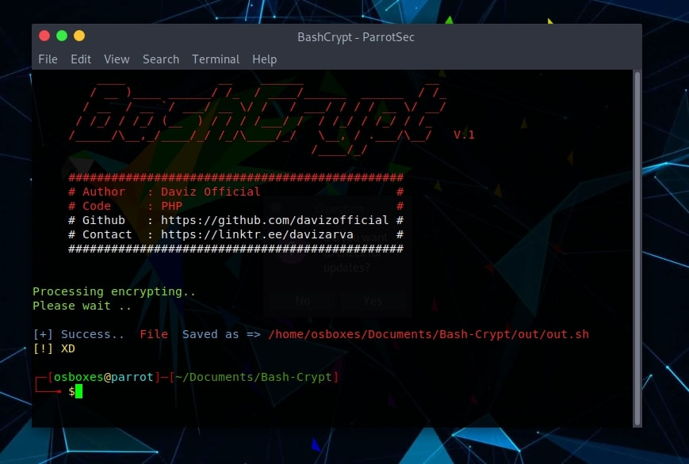
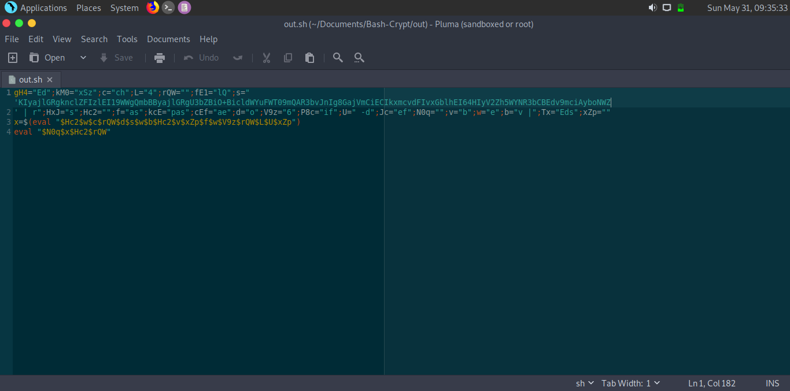

# bash-crypt
Bash-Crypt is an open source project 
## Clone
```
$ git clone https://github.com/davizofficial/Bash-Crypt
```
## Requirements
The aim of this project is to make difficult code that can't be read by people, and avoid copy paste
```
$ pkg install php
```
```
$ pkg install bash
```
```
$ pkg install git 
```
```
$ git clone https://github.com/davizofficial/Bash-Crypt
```
## Uses
```
$ php enc.php
```

## Contact
*[Social Media](https://linktr.ee/davizarva)*

# Operating system
<b> [+] Linux
# Screenshots


<h1> License </h1>


<br>Copyright 2020 (c) Daviz Official
